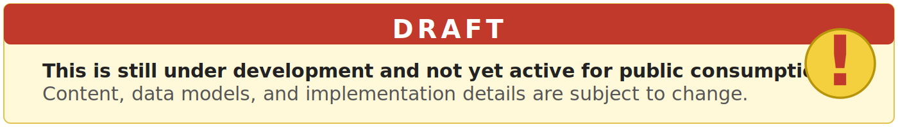

  

# Draft PH Road Safety Implementation Guide

A FHIR Implementation Guide for Road Safety and Health Information in the Philippines

---

> **Project Status: In Development**
>
> This repository is under active development and is not yet available for public or production use. Documentation, data models, and implementation details are subject to change.

---

## Project Overview

Road-traffic injuries are among the most preventable yet under-reported public health threats in the country. Data is fragmented across paper forms, stand-alone apps, and ad-hoc spreadsheets, creating critical blind spots for policymakers, emergency responders, and families. The Draft PH Road Safety Implementation Guide aims to close these gaps by defining a consensus-driven MDS and mapping it to HL7 FHIR R4 resources, enabling interoperable, machine-readable data exchange nationwide.

The **Draft PH Road Safety Implementation Guide** is a collaborative, evidence-based initiative to standardize and digitize road safety and injury data across the Philippines. This project is being developed by the [National Telehealth Center - National Institutes of Health, UP Manila](http://telehealth.ph/) - [Standards and Interoperability Lab Philippines (SIL-PH)](https://github.com/UPM-NTHC/PH-RoadSafetyIG), in partnership with the Department of Health and a broad coalition of government, academic, health, and technology stakeholders.

This project follows the [WHO SMART Guidelines](https://www.who.int/teams/digital-health-and-innovation/smart-guidelines) framework for digital health standards. The Draft PH Road Safety Implementation Guide (IG) represents the **Level 3 (L3) "Machine Readable"** artifact in the SMART Guidelines process, translating validated workflows and a Minimum Data Set (MDS) into interoperable HL7 FHIR R4 specifications.

---

## How This Guide Was Built

The Draft PH Road Safety IG is grounded in a series of project-led co-design workshops and feedback sessions (2025), which brought together over 30 stakeholders from emergency medical services, traffic management, hospitals, local government units, and relevant agencies. Using a human-centered design approach, participants:

- Mapped real-world workflows and data handoffs from crash scene to post-crash response.
- Identified and prioritized critical data elements for reporting and surveillance.
- Validated and harmonized the MDS with key systems (e.g., DOH ONEISS, MMDA Run Report).
- Aligned indicators and requirements with the Philippine Road Safety Action Plan (PRSAP) 2023–2028 and WHO SMART Guidelines.

The resulting Implementation Guide is consensus-driven, operationally validated, and designed to support both national reporting and local clinical needs.

---

## Key Features

- **L2 Minimum Data Set (MDS):** 223 data elements, classified as Mandatory, Must Support, or Optional, covering Scene, Transport, Facility, and Post-Crash Investigation.
- **FHIR R4 Mapping:** All data elements are mapped to HL7 FHIR R4 resources for semantic and syntactic interoperability, in line with the WHO SMART Guidelines L3 (Machine Readable) standard.
- **Stakeholder-Driven:** Developed through workshops and feedback with EMS, hospitals, government, NGOs, and technology partners.
- **Supports Policy and Interoperability:** Aligned with DOH’s 8-Point Action Agenda, Universal Health Care Act, and PRSAP 2023–2028.
- **Open, Extensible, and Reproducible:** Built using open standards and tools (SUSHI, FHIR IG Publisher), with clear documentation for contributors.

---

## Partners and Funders

- **Implementing Agency:** National Telehealth Center, National Institutes of Health, University of the Philippines Manila
- **Funding Agency:** Department of Health

---

## Documentation

- ~~See the [Wiki](https://github.com/UPM-NTHC/PH-RoadSafetyIG/wiki) for technical documentation, installation, build instructions, and modeling standards.~~ _(ongoing re-development)_
- This Implementation Guide and its Minimum Data Set are still being finalized and validated. For questions, refer to the ~~wiki~~.

---
## Future Plans

Upon finalization of the official Road Safety FHIR Implementation Guide, the content of this repository will be transitioned to a more appropriate and permanent location.
