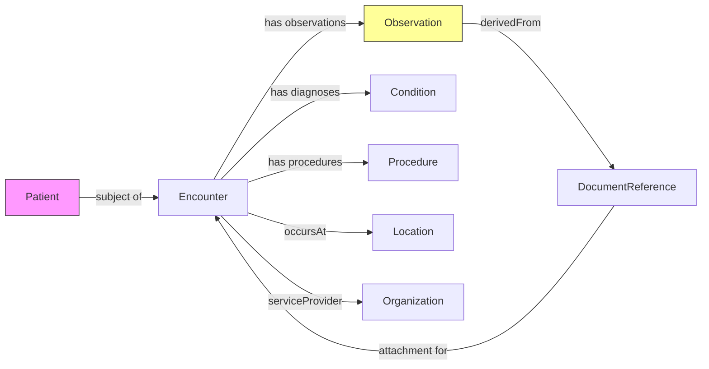

# General Data Model - Discussion and integration notes

- This page gives a high level overview of the mapped FHIR resources from workshops (dot-vote priorities, ONEISS, ONEISS vs NHDR mapping), map MDS fields to FHIR resources (Observation, Encounter, Condition, DocumentReference, Procedure, Patient, Location, etc.) and note areas marked MUST SUPPORT.

Key decisions (high-level)
- Use Observation for most scene/transport vitals, triage, collision/vehicle details and many external-cause elements.
- Use Encounter for the transport/visit context and participant roles (team lead, treatment officer, transport officer, receiving staff).
- Use DocumentReference for post-crash reports, attachments (cause of crash, party at fault, reconstruction materials).
- Use Condition for diagnosis/icd-10/nature of injury.
- Use Procedure for psychosocial support, coordination tasks, and other performed procedures.
- Use Patient/Location/Organization references where appropriate for identifiers and facility information.

Mermaid diagram (simplified)

